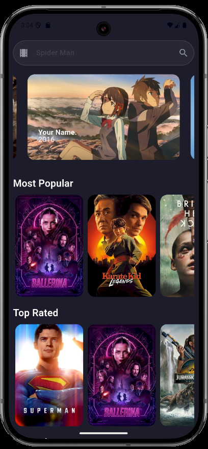
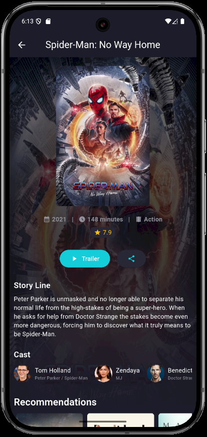

## 📖 **Descrição**

O **Movie Database App** é um aplicativo Flutter desenvolvido como parte de um teste para uma vaga de estágio. Ele permite que os usuários pesquisem filmes, visualizem detalhes, assistam trailers, compartilhem informações e explorem categorias como filmes populares, mais bem avaliados e lançamentos futuros. O aplicativo utiliza a API do [The Movie Database (TMDb)](https://www.themoviedb.org/) para obter informações sobre filmes.

---

## 🚀 **Funcionalidades**

- **Busca de Filmes**: Pesquise filmes por título e visualize os resultados.
- **Detalhes do Filme**: Veja informações detalhadas, como sinopse, elenco, duração, gênero e avaliação.
- **Trailer**: Assista ao trailer do filme diretamente no YouTube.
- **Compartilhamento**: Compartilhe informações sobre filmes via redes sociais ou copie o link.
- **Exploração de Categorias**:
  - Filmes Populares
  - Mais Bem Avaliados
  - Lançamentos Futuros
  - Filmes em Alta
- **Cache de Dados**: Reduz chamadas repetidas à API, melhorando o desempenho e economizando dados.

---

## 🛠️ **Tecnologias Utilizadas**

- **Flutter**: Framework para desenvolvimento multiplataforma.
- **Dart**: Linguagem de programação utilizada no Flutter.
- **API TMDb**: Fonte de dados sobre filmes.
- **Pacotes Flutter**:
  - [`cached_network_image`](https://pub.dev/packages/cached_network_image): Para armazenar imagens em cache.
- [`flutter_dotenv`](https://pub.dev/packages/flutter_dotenv): Para armazenar as chaves secretas e manter a segurança.
  - [`carousel_slider`](https://pub.dev/packages/carousel_slider): Para exibir carrosséis de filmes.
  - [`http`](https://pub.dev/packages/http): Para realizar chamadas HTTP.
  - [`share_plus`](https://pub.dev/packages/share_plus): Para compartilhar informações.
  - [`url_launcher`](https://pub.dev/packages/url_launcher): Para abrir links externos.

---

## 📋 **Como Executar o Projeto**

### **Pré-requisitos**

1. Instale o [Flutter](https://flutter.dev/docs/get-started/install) e configure o ambiente.
2. Obtenha uma chave de API do [TMDb](https://www.themoviedb.org/documentation/api).

### **Passos**

1. Clone o repositório:
   ```bash
   git clone https://github.com/Zilla3k/tmdbflttr
   cd tmdbflttr
   ```
2. Instale as dependências:
   ```bash
   flutter pub get
   ```
3. Crie e configure a chave de API no arquivo .env:
   ```dart
   BEARER_TOKEN=SUA_CHAVE_DE_API
   ```
4. Execute o aplicativo:
   ```bash
   flutter run
   ```

---

## 🖼️ **Capturas de Tela**

### **Tela Inicial**

Exibe as categorias de filmes em carrosséis.


### **Busca de Filmes**

Permite pesquisar filmes por título.


### **Detalhes do Filme**

Exibe informações detalhadas sobre o filme, incluindo elenco e trailer.


### **Compartilhar Informações do Filme**

Permite compartilhar informações sobre o filme em redes sociais ou copiar.


---

## 🛡️ **Boas Práticas Implementadas**

- **Cache de Dados**: Reduz chamadas repetidas à API.
- **Responsividade**: Interface adaptada para diferentes tamanhos de tela.

---

## 📚 **Possíveis Melhorias**

- Adicionar suporte a internacionalização (i18n) com o pacote `flutter_localizations`.
- Implementar testes unitários e de integração.
- Melhorar a interface com animações e transições mais suaves.
- Gerenciamento de Estado: Uso do `Provider` para separar lógica de negócios da interface.

---
